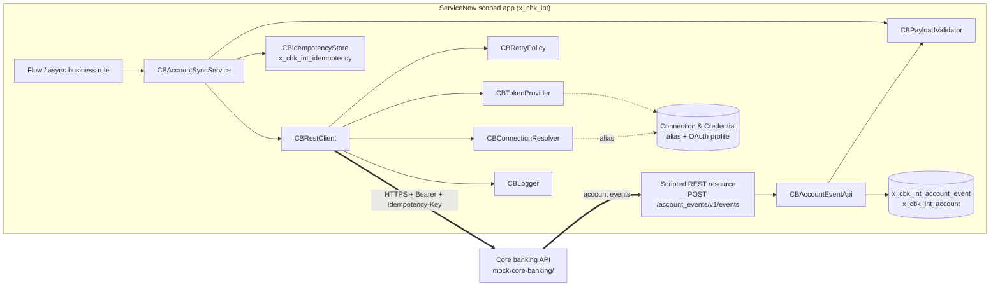

# ServiceNow Integration Patterns

> **Disclaimer:** Representative portfolio project built with synthetic data. Not derived from any employer or client code.

Reusable, ES5-compatible **Script Include** patterns for integrating a ServiceNow scoped application with a backend system. Here the backend is a synthetic "Contoso Bank" core banking API. The patterns are unit tested in Node against lightweight mocks of `GlideRecord`, `gs`, `sn_ws.RESTMessageV2`, `sn_auth` and `sn_cc`, and run end to end against a local mock API.

## Business use case

A bank runs account servicing in ServiceNow: account opening requests, freezes, limit changes. Every one of these touches the core banking platform, so the integration has to be dependable:

- **No duplicate accounts.** If a flow retries after a timeout, the customer still gets exactly one account.
- **Safe recovery from brief outages.** Short provider failures (503s and 429s) shouldn't create manual work for the operations team.
- **No credentials in code**, and configuration that differs per environment (dev, test, prod) without a code change.
- **Traceability.** One correlation id links the ServiceNow request, the outbound call and the provider's logs.
- **Strict inbound contracts.** Events pushed into ServiceNow are validated and deduplicated, and errors come back in a consistent, documented shape.

## What it demonstrates

| Pattern | Script Include | Key points |
|---|---|---|
| Outbound REST wrapper | `CBRestClient` | Wraps `sn_ws.RESTMessageV2`. Endpoint comes from a Connection & Credential alias. Adds a correlation id header. Returns a result object and never throws for HTTP errors. |
| OAuth 2.0 (client credentials) | `CBTokenProvider`, `CBConnectionResolver` | Uses the alias's connection record and OAuth profile, so no secret appears in script. Tokens are cached with an expiry margin, and the client refreshes once on a 401. Enforces HTTPS. |
| Retry and backoff | `CBRetryPolicy` | Exponential backoff with jitter, honours `Retry-After`, retries only 408/425/429/5xx and transport errors. Limits are tunable through system properties. |
| Idempotency | `CBIdempotencyStore` | Deterministic key per (record, action), request hash, and `in_progress`/`completed`/`failed` states. The key is also sent as the `Idempotency-Key` header. POST requests without a key are never retried. |
| Payload validation | `CBPayloadValidator` | A small schema validator (type, required, enum, pattern, length and range checks, `additionalProperties`) that reports a path for every error. |
| Structured logging | `CBLogger` | One JSON object per log line, with level threshold, redaction of secrets and tokens, and truncation of long values. |
| Inbound Scripted REST API | `CBAccountEventApi` + `scripted-rest/account_events_post.js` | Thin resource script. Checks content type, validates the payload and deduplicates on event id. Error codes 400/409/415/422/500 share one envelope. No stack traces are returned to callers. |
| Transform / coalesce | `CBCoalesceHelper` | Upsert in the style of a transform map: coalesce on key fields, map and transform fields, skip unchanged rows, reject rows that match more than one record. |
| End-to-end example | `CBAccountSyncService` | Validate, claim the idempotency key, POST with retry, then write the result back to the request record. |

## Architecture



More detail, including a sequence diagram of the retry and idempotency flow, is in [`docs/architecture.md`](docs/architecture.md).

## Repository layout

```
src/script-includes/       ES5 Script Includes (copy into the instance as-is)
src/scripted-rest/         Scripted REST resource script
test/harness/              Platform mocks + vm loader + synchronous HTTP transport
test/*.test.js             node:test suites (unit, inbound, mock server, end-to-end)
mock-core-banking/         Mock core banking API (node:http, synthetic data)
demo/run-demo.js           Runs the Script Includes against the mock API
docs/                      Architecture, integration decision guide, porting guide, demo output
```

## Tech stack

ServiceNow server-side JavaScript (ES5) · Node.js 22+ · `node:test` · ESLint (ES5 is enforced for `src/`) · GitHub Actions

## Setup

```bash
git clone https://github.com/abdulraheemm064/servicenow-integration-patterns.git
cd servicenow-integration-patterns
npm ci
```

## Usage

```bash
npm test          # all suites (unit + inbound + mock API + end-to-end over HTTP)
npm run lint      # ESLint, with src/ parsed as ECMAScript 5
npm run demo      # end-to-end walkthrough against the mock API

# Run the mock API on its own (credentials come from your environment)
cp .env.example .env    # then set your own values
set -a && source .env && set +a
npm run mock:server
```

How the harness works: `test/harness/environment.js` loads every file in `src/script-includes/` into a Node `vm` context that exposes the mocked globals, much as the instance loads Script Includes. The source files are not modified for testing. The mocks cover only what these patterns use and are not a platform emulator.

## Sample output

From `npm run demo` (full output in [`docs/demo-output.txt`](docs/demo-output.txt)):

```
=== 1. Open account; provider returns 503 twice (injected), client retries with backoff ===
  [warn ] CBRestClient.http.retry {"attempt":1,"status":503,"delay_ms":177}
  [warn ] CBRestClient.http.retry {"attempt":2,"status":503,"delay_ms":322}
  [info ] CBRestClient.http.response {"method":"POST","path":"/api/v1/accounts","status":201,"attempt":3,...}
  result: {"status":"opened","accountNumber":"CB40000001"}

=== 2. Same request processed again (e.g. flow re-run): no second account is created ===
  [info ] CBAccountSyncService.idempotency.replay {"key":"cbk-1C2A..."}
  result: {"status":"opened","accountNumber":"CB40000001","replayed":true}

=== 3. Inbound Scripted REST: core banking pushes an "account.frozen" event ===
  first delivery  -> 201 {"result":{"event_id":"evt-demo-000001",...,"status":"accepted"}}
  redelivery      -> 200 {"result":{"event_id":"evt-demo-000001",...,"status":"duplicate"}}
  invalid payload -> 400 {"error":{"code":"VALIDATION_FAILED",...}}
```

Delay values vary between runs because of jitter. `elapsed_ms` shows 0 because the harness uses a simulated clock.

## Tests

51 tests across 6 files:

| Suite | Covers |
|---|---|
| `logger-validator-retry.test.js` | Redaction, truncation, reserved fields, every validator keyword, backoff, cap, jitter, Retry-After |
| `rest-client.test.js` | Headers, query encoding, retry on 5xx/429/exceptions, no retry on 4xx, unsafe-method guard, refresh-once on 401, token caching and expiry, https enforcement |
| `account-sync.test.js` | Happy path, replay without a second call, retry with the same key, release after failure, conflicts, pending state |
| `coalesce-and-inbound.test.js` | Insert/update/skip, ambiguous coalesce, every inbound error code, duplicate events, 500 handling without leaking internals |
| `mock-server.test.js` | OAuth grant, token expiry, idempotent replay and key reuse, validation, fault injection |
| `integration.test.js` | The unchanged Script Includes over real HTTP against the mock API in a child process |

## Security considerations

- **Secrets**: Script Includes never handle client secrets. On an instance they belong in the OAuth entity profile or credential record behind the alias. The mock server reads them from environment variables and refuses to start without them. The demo generates a random secret for each run.
- **Transport**: `CBConnectionResolver` rejects non-HTTPS endpoints, except `localhost` for the mock.
- **Logging**: keys that look like authorization headers, tokens, secrets, passwords or API keys are redacted, and long values are truncated. Request and response bodies are not logged by default.
- **Inbound**: requires authentication and an ACL on the Scripted REST resource for a dedicated integration role (configured on the instance, see the porting guide). Payloads are validated with `additionalProperties: false`, nothing in the body is trusted for identity, and internal errors return only a code and a correlation id.
- **Idempotency**: keys are derived from record sys_id and action. They don't contain customer data, and a request hash detects a changed payload sent under an old key.
- **Least privilege**: the outbound integration user or role should be limited to the tables this app writes.

## Limitations and future enhancements

- `gs.sleep()` holds a worker thread during backoff. That's acceptable for short delays in async contexts. For longer outages, re-queue the work with a scheduled job, an event, or a Flow Designer wait instead of sleeping.
- The token cache lives on the script object, so it only lasts for the current transaction. Where the provider supports it, prefer `setAuthenticationProfile('oauth2', ...)` and let the platform manage tokens.
- The idempotency `begin()` is check-then-insert. On a real instance, add a unique index on `key` to close the race window between concurrent transactions.
- The mocks implement only a subset of each platform API. Check method signatures against your release before porting.
- Ideas for later: an IntegrationHub spoke version of the outbound call (REST step plus a custom action), a dead-letter table with a retry dashboard, contract tests from an OpenAPI spec, and ATF tests for the Scripted REST API.

## Further reading in this repo

- [`docs/architecture.md`](docs/architecture.md) - components, sequence diagrams, data model
- [`docs/integration-decision-guide.md`](docs/integration-decision-guide.md) - when to use synchronous REST, event-driven integration or Import Sets
- [`docs/porting-to-instance.md`](docs/porting-to-instance.md) - moving this into a real scoped app with Studio / App Engine and Git source control

## Licence

MIT. See [LICENSE](LICENSE).

---

Representative portfolio project built with synthetic data. Not derived from any employer or client code. ServiceNow API names are used only to describe the patterns. This project is not affiliated with or endorsed by ServiceNow.
