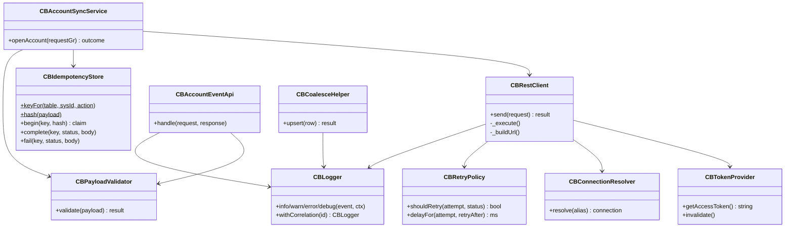
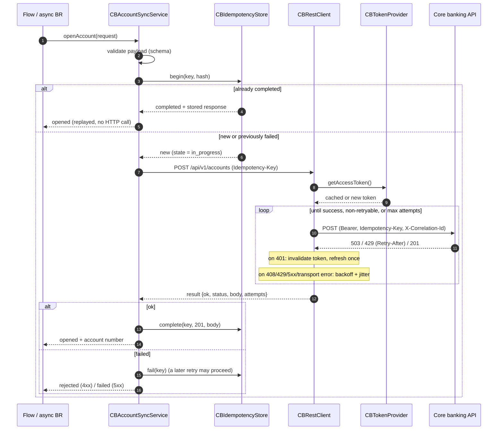
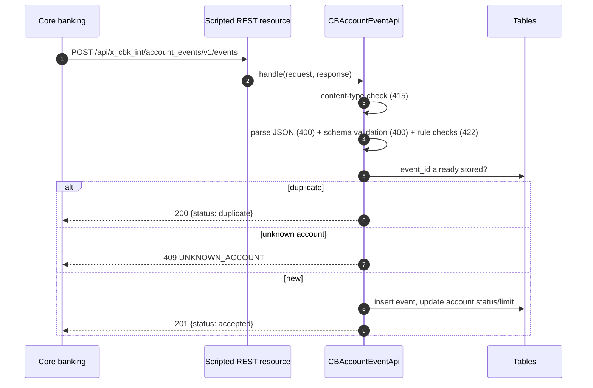

# Architecture

> Representative portfolio project built with synthetic data. Not derived from any employer or client code.

## Components

## Outbound: open account with retry and idempotency

There are two layers of protection against duplicates:

1. **ServiceNow side:** a completed key short-circuits before any HTTP call.
2. **Provider side:** if a request reached the provider but the response was lost (for example a timeout), the retry carries the same `Idempotency-Key`, and the provider replays its original response instead of creating a second account.

## Inbound: account events

## Data model (scoped tables)

| Table | Purpose | Key fields |
|---|---|---|
| `x_cbk_int_account_request` | Account opening requests raised in ServiceNow | `customer_id`, `product_code`, `currency`, `initial_deposit`, `branch_code`, `state`, `account_number`, `status_message`, `correlation_id` |
| `x_cbk_int_account` | ServiceNow's reference copy of accounts | `account_number` (unique), `customer_id`, `status`, `currency`, `daily_limit` |
| `x_cbk_int_account_event` | Inbound events (audit + dedup) | `event_id` (unique), `event_type`, `account` (reference), `occurred_at`, `reason_code`, `correlation_id` |
| `x_cbk_int_idempotency` | Outbound idempotency keys | `key` (unique), `request_hash`, `state`, `response_status`, `response_body`, `expires_on` |

## System properties

| Property | Default | Used by |
|---|---|---|
| `x_cbk_int.retry.max_attempts` | 4 | CBRetryPolicy |
| `x_cbk_int.retry.base_delay_ms` | 500 | CBRetryPolicy |
| `x_cbk_int.retry.max_delay_ms` | 8000 | CBRetryPolicy |
| `x_cbk_int.idempotency.ttl_days` | 30 | CBIdempotencyStore |
| `x_cbk_int.log.level` | info | CBLogger |
