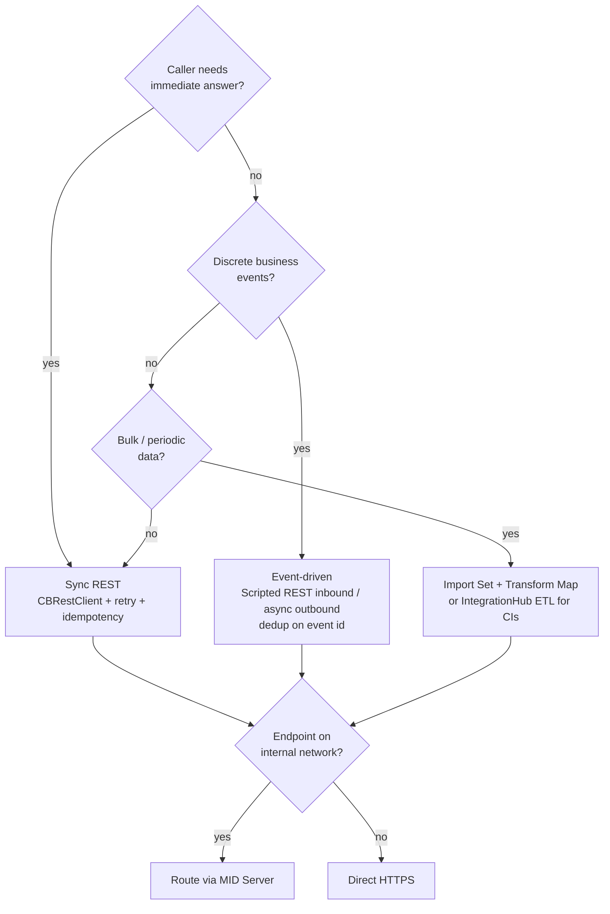

# Choosing an integration style: synchronous REST, event-driven, or Import Sets

> Representative portfolio project built with synthetic data. Not derived from any employer or client code.

The patterns in this repository are building blocks. Which integration style to build around them depends on what the business process needs. This is the checklist I use.

## Summary

| | Synchronous REST (request/response) | Event-driven (async push / queue) | Import Sets (batch / staged) |
|---|---|---|---|
| **Use when** | The user or flow needs the answer now (validate, look up, create and get an id back) | Something happened elsewhere and ServiceNow should react, or the other way round, without waiting | Bulk or periodic loads; the source can produce files or pageable extracts |
| **Typical volume** | Low to medium, per transaction | Medium to high, spiky | High (thousands to millions of rows) |
| **Latency** | Seconds | Seconds to minutes | Minutes to hours (scheduled) |
| **Coupling** | Tight: the caller depends on the provider being up | Loose: a broker or retry absorbs outages | Loose: staging decouples load from transform |
| **Failure handling** | Retry with backoff + idempotency keys; tell the user if it still fails | Redelivery + dedup on event id; dead-letter queue | Row-level errors in the staging table; re-run the transform |
| **ServiceNow building blocks** | RESTMessageV2 / IntegrationHub REST step, Connection & Credential alias, OAuth profile | Scripted REST API (inbound), Business Rule / Flow to publish outbound, events (`gs.eventQueue`), message queues via a MID Server or a spoke | Data Source, Import Set table, Transform Map (coalesce), scheduled import; IntegrationHub ETL for CMDB |
| **In this repo** | `CBRestClient`, `CBAccountSyncService` | `CBAccountEventApi` (inbound), event-id dedup | `CBCoalesceHelper` (same coalesce semantics for scripted loads) |

## Decision questions

1. **Does a person or a flow step need the result immediately?** If yes, use synchronous REST. Keep the call short, set a timeout, and make it idempotent. If no, go to question 2.
2. **Is it a stream of individual business events?** (account frozen, payment failed, alert raised.) If yes, use event-driven integration. Make consumers idempotent, keyed on a provider event id, and accept that events can arrive out of order. Store `occurred_at` and handle stale updates.
3. **Is it reference or master data that changes in bulk?** (customer segments, branch list, asset inventory.) If yes, use Import Sets with a transform map, coalescing on a stable business key. For CI data, use IntegrationHub ETL or the IRE API so identification and reconciliation still apply.
4. **Is the endpoint inside the corporate network?** Then route through a MID Server, whatever the style.
5. **Is the provider rate limited, or does it have maintenance windows?** Favour async or batch, or put a queue in front of synchronous calls.

## Anti-patterns to avoid

- **Synchronous calls in before business rules on user-facing forms.** A slow provider slows every save. Use async business rules or Flow instead.
- **Retrying POSTs without an idempotency key.** This is the most common way integrations create duplicate records downstream. `CBRestClient` refuses to retry unsafe methods unless a key is supplied.
- **Long `gs.sleep()` backoff.** It ties up a worker thread. For anything beyond a few seconds, re-queue (scheduled job, event, Flow wait).
- **Coalescing on display names or empty values.** It merges unrelated records. `CBCoalesceHelper` rejects empty keys and matches against more than one record.
- **Loading CIs straight into `cmdb_ci_*` tables with transform maps.** This bypasses IRE and creates duplicates. Use IRE, through IntegrationHub ETL or the identification API.
- **Logging full payloads in production.** They contain personal or account data. Log identifiers and correlation ids instead (see `CBLogger` redaction).

## How the patterns combine

